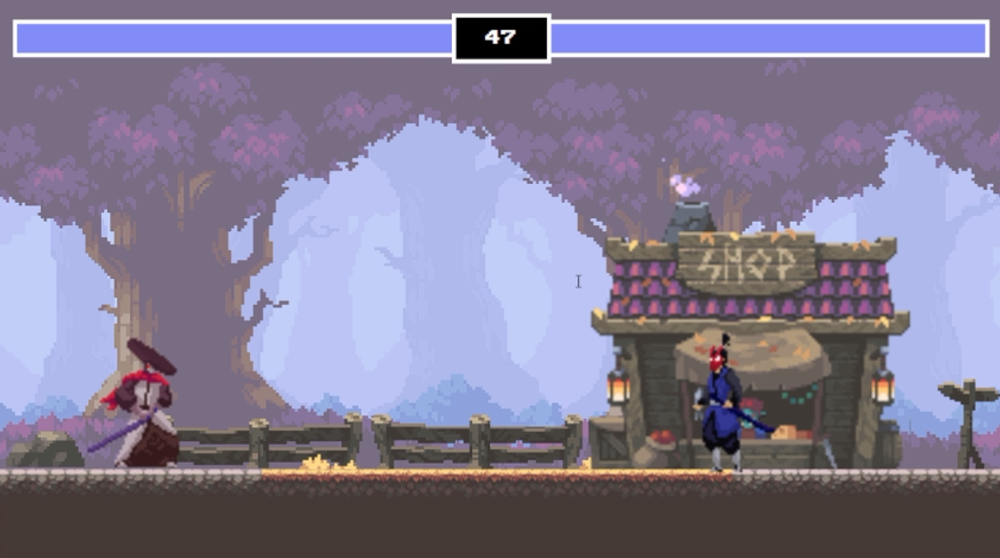
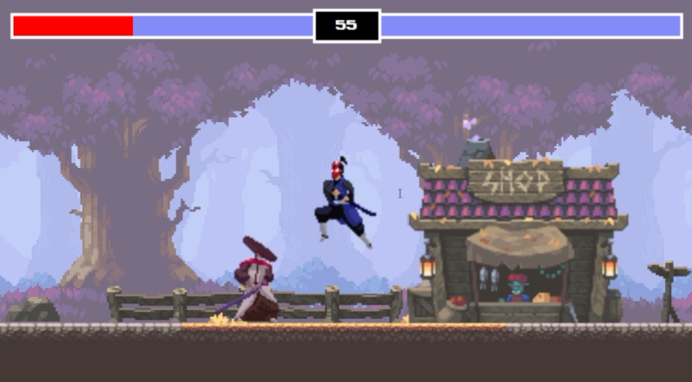

# Fighting Game

A simple two-player fighting game built using HTML5 and JavaScript. Players can control their characters, perform attacks, and compete against each other. The game includes health bars, attack animations, and a timer to determine the winner.

## Preview






## Table of Contents

- [Features](#features)
- [How to Play](#how-to-play)
- [Installation](#installation)
- [Contributing](#contributing)

## Features

- Two-player fighting game with interactive character control.
- Health bars for both players to track their health during the game.
- Attack animations and collision detection for accurate gameplay.
- Timer to determine the winner if the game reaches a time limit.

## How to Play

1. **Controls:**

   - Player 1 (Left Fighter):
     - Move Left: `A`
     - Move Right: `D`
     - Jump: `W`
     - Attack: `S`
   - Player 2 (Right Fighter):
     - Move Left: `Left Arrow`
     - Move Right: `Right Arrow`
     - Jump: `Up Arrow`
     - Attack: `Down Arrow`

2. **Gameplay:**

   - Players control their fighters to move, jump, and attack.
   - The health bars indicate the current health of each player.
   - Perform attacks when close to the opponent to reduce their health.
   - The game features attack animations, collision detection, and gravity effects.

3. **Winning:**
   - The game has a timer set to a specific duration (e.g., 60 seconds).
   - When the timer runs out, or if one player's health reaches zero, the game determines the winner.
   - The player with more health remaining wins. If health is tied, the game ends in a tie.

## Installation

1. Clone the repository to your local machine:

```bash
   git clone https://github.com/yourusername/fighting-game.git
   cd fighting-game
```

2. Open the `index.html` file in a web browser to start playing the game.

## Contributing

Contributions are welcome! If you want to contribute to this project, follow these steps:

1. Fork the repository.
2. Create a new branch for your feature: `git checkout -b feature-name`.
3. Make your changes and commit them: `git commit -m 'Add some feature'`.
4. Push to the branch: `git push origin feature-name`.
5. Open a pull request on GitHub.

## Related

Enjoy playing the game and feel free to customize, enhance, or contribute to the project!

Feel free to copy and paste this content into your `README.md` file in your project repository. Just remember to replace `yourusername` with your actual GitHub username and customize any other details as needed.
